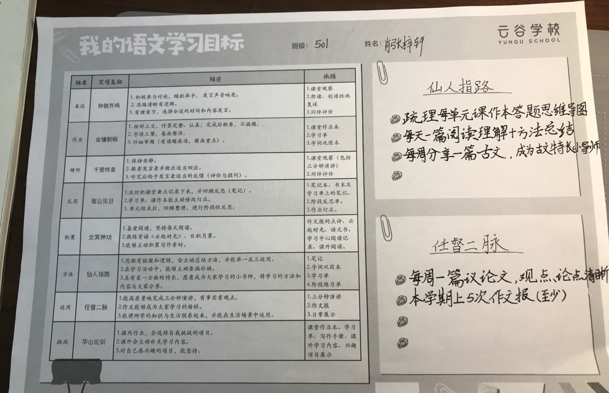

**新学期契约**

学科类：

不纠结、寻挑战、战必胜

兴趣类：

1、编程课 一周三次 隔天一次

2、吉他课 一周一次，安排周末

3、书法课 一周两次 

4、古文 每周三篇理解背诵，每周一课录播

休闲类：

1、周末定义：周六和周日

2、电影：周末一部

3、游戏：每周末40分钟

4、阅读：每天半小时散文类批注

5、日记：每日随笔一篇，每周英文blog一篇

6、电视：吃饭时不看电视，饭后15分钟可以看