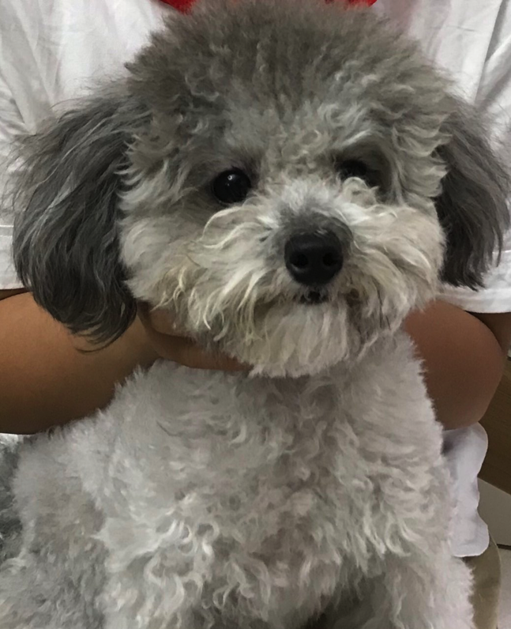

一对水汪汪的大眼睛，灰乎乎软糯糯的绒毛，四条小短腿儿，这就是我心爱的玩伴-我们家的灰泰迪。 

别看这小家伙腿短，跑得可快了，热一点的时候不能出门，她会跟我在家里绕圈跑，耳朵竖立，尾巴欢快摇动，跑起来仿佛整个世界都要被她甩在身后。温度适宜时，她会跟我们户外跑五公里，我们俩累得气喘吁吁的时候，她却昂首挺胸不紧不慢跟着，四条腿协调地交替着，满身的绒毛跟着小风舞蹈，好像她的生体里有无尽的运动细胞在燃烧，快乐遍布生体的每一个角落。这仿佛对她而言仅是一次热身，真是一个长跑健将呀！

别看她小，她可能吃了。每当我们吃饭的时候，她就可怜巴巴地扒拉着我的大腿，如同一只刚结束冬眠的小灰熊，两眼发光，这时候的她对狗粮就毫无兴趣了。我们总担心她吃人类食物要拉肚子，所以也很少给她吃我们的餐食，她百般哀求无果的时候，就只好灰溜溜回去心不甘情不愿地吃狗粮了，边吃还边不时地哀怨地看我们一眼。 

这就是我最亲爱的玩伴-Cookie，她总是能给我带来快乐，在伤心的时候带来安慰。

