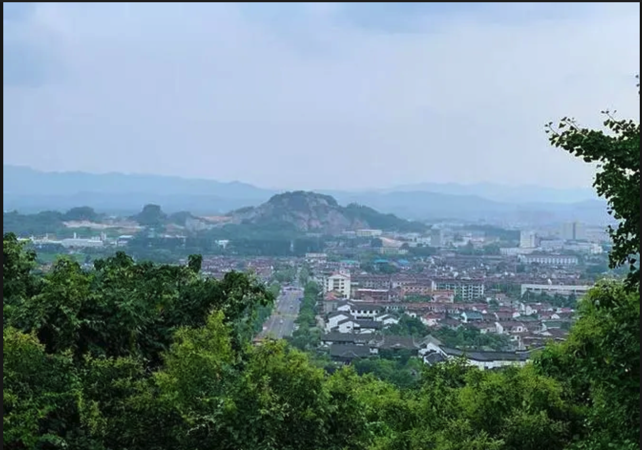

我最喜爱的老何山

幼时童年，多么有趣！相信很多人幼时有喜爱的地方，或是游乐场，或是小公园，但我最喜爱的，却是普普通通的一座老何山。

老何山的春天，是清脆的，是温柔的。沿着牌坊后面蜿蜓的小山径一步一步进发，两边绿树的新芽，被阳光镶上了一道金边，穿过鸟鸣声，便来到了叮叮咚咚还冒着泡的溪边。从石上跳过，顿觉清风徐徐，还夹杂着些许青草香。登上山顶的凉亭，望着下面薄雾弥漫的西湖，朦胧可见有几只游船在湖面上漂淫，滑行而过。

老何山的夏天，是阴凉的，是清幽的。游走在林中小径间，仿佛两旁绿荫向行者挤压过来。来到一段清幽小道，烈日透过林层，变得温和，轻轻地，缓缓地，散落在我的脸上。花香从不近不远的地方，不急不徐的，一荡一荡的，幽幽飘来，真是沁人心脾。

老何山的秋天，是黄的，是灰的。落叶映着阳光，纷纷扬扬，乘着风，去远方旅行。灰色的青石板上，满是选择留下的叶子，也许，它们是本着“化作春泥更护花”的想法才留下的吧。脚踩落叶沙沙的声响，也许就是对着金秋最美好，最完美的诠释了吧。

老何山的冬天，是雪白的，是纯洁的。路边的一朵无名小花，迎着严寒绽放，使行者流下了一抹泪眼。给光秃秃的树枝裹上了一层银装，铺上了一层白色绵缎。

四季老何山，叫人多沉醉！