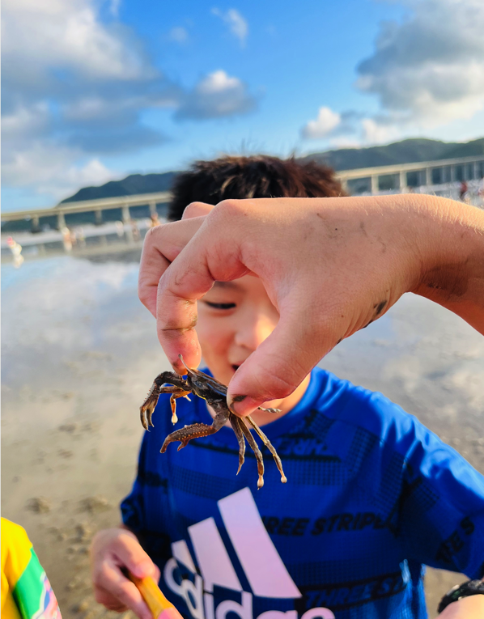
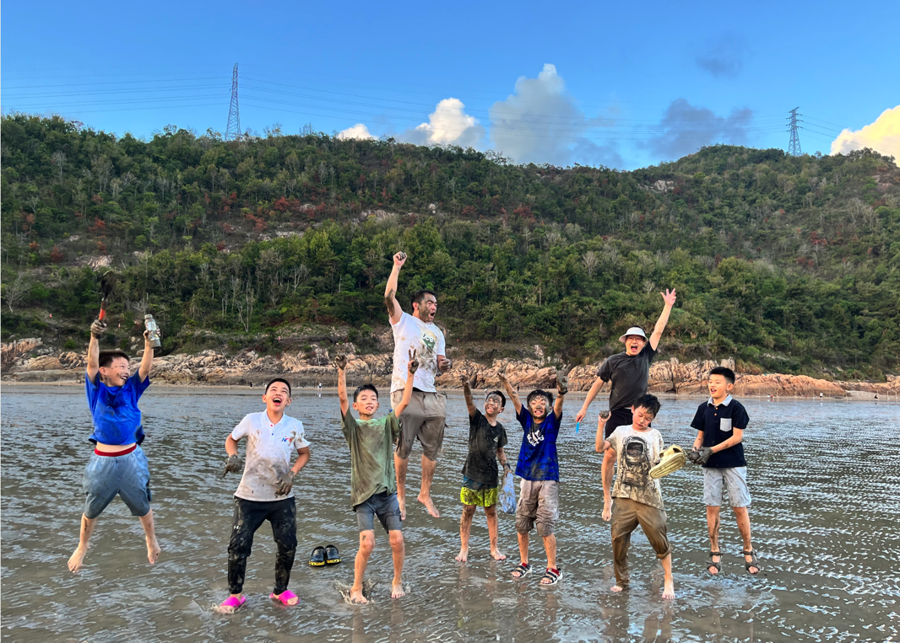
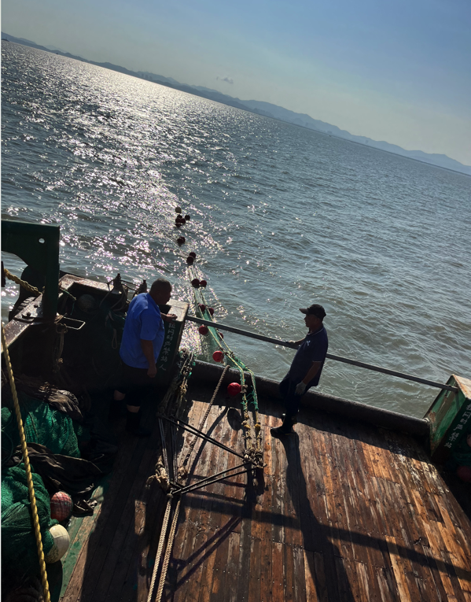
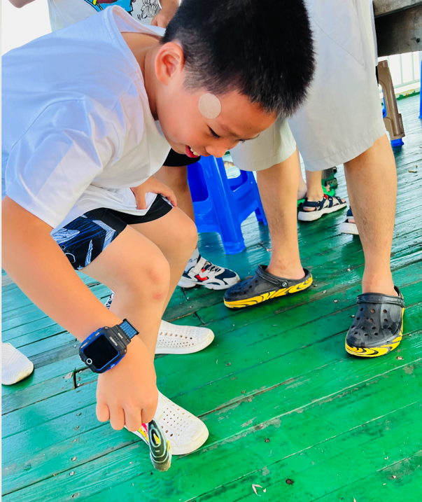
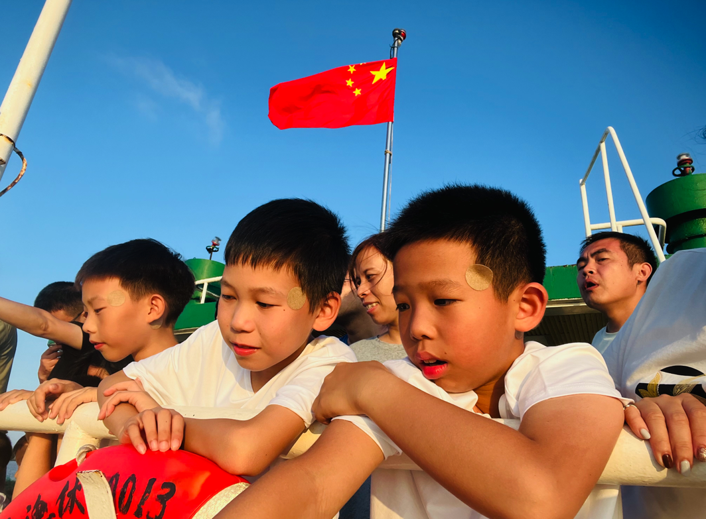
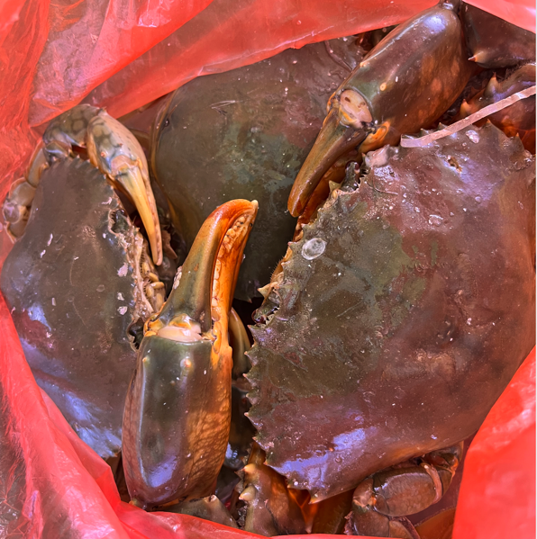
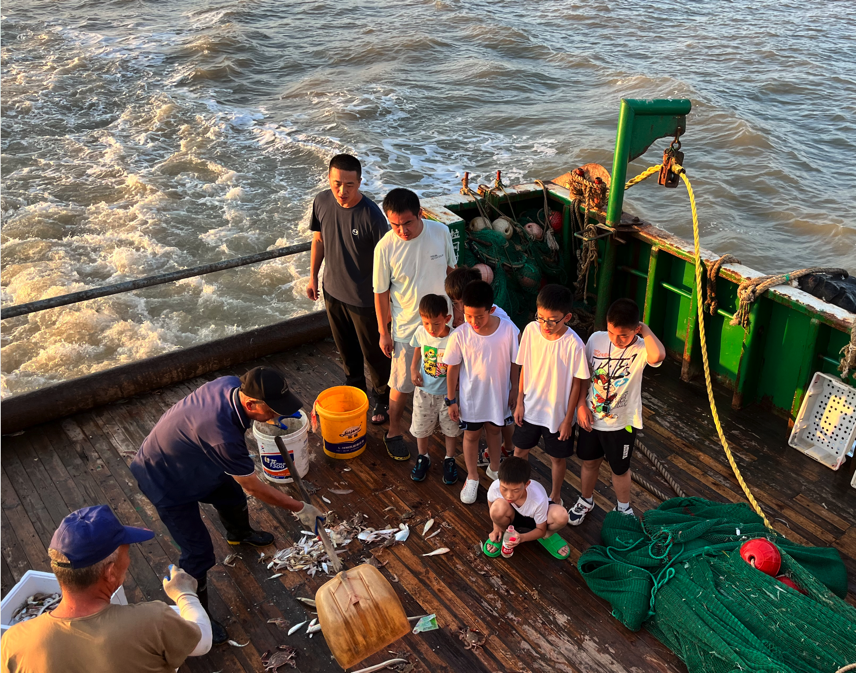
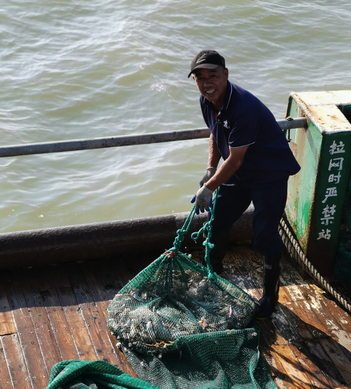
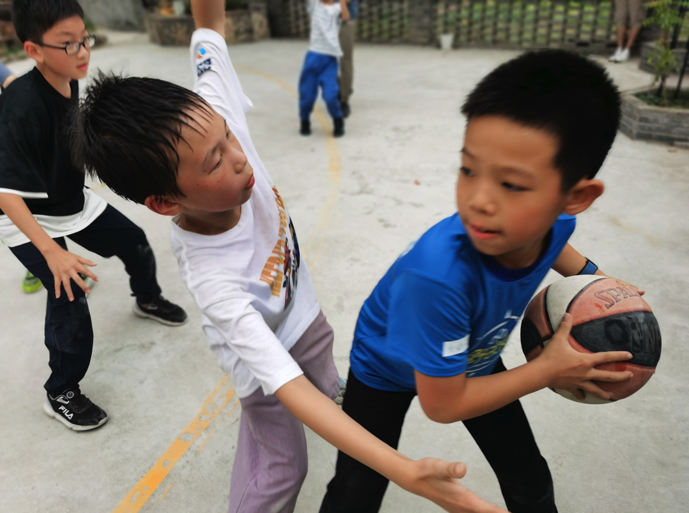
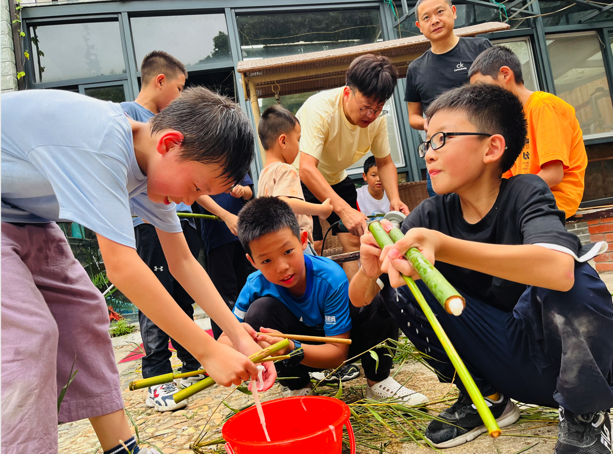

National Holiday Fun

I havested much fun this National holiday, the best part that I want to share with you is the trip to Taizhou Yuhuan, which is Ruby's home town. 

All about the foods. 														

The seafood in Yuhuan is fresh and delicious, when you are in a feast you will see many crabs, shrimps, sea fish, shell fish, and all types of see food I've never seen or tasted before. So why there are so many wonderful sea foods here? The answer is that  Yuhuan is just by the seaside, and there are so many  fishermen sailing to the sea to get back the treasures of the sea.Every meal we had in Yuhuan are all seafood feast. The crabs are sweet and juicy, crab meat all tightly packed in the shell; the shimps are enormous and crunchy, every bite of it is heavenly; the shellfish are soft and no bones, tasted like tofu. And there are even sharks and Ankang fish on the table! Every meal all I targeted was crab, crab and crab, this was the best crab feast I ever had, and I was so satisfied!

All about catching crabs. 

The sea is beautiful as it is, it's even more fun when the tide falls. When the sea water goes down, all there is left on the bank is mud. There are some baby crabs and shell fish live in the mud holes, they quickly shift from one hole to another, and the crabs walk sideways. When we spotted a hole, we knew there must be a crab underneath, so what we do is to use a shovel to dig the hole along the way the crab escapes, and then, tada! The crab is caught, then we picked it up carefully and put it into the bucket. 

All about go sea fishing. 

Have you ever go sea fishing before? If you have, then you must feel the way I felt, it's full of fun and happiness! Haha, we are sailing! Now I am imaging I'm capitan Thomas, and leading my crew all the way to the deep sea to hunt for treasure box. The treasure for us ofcause is just full loads of seafood. When we started sailing, the fisherman dropped a huge fishing net, and when we got to the middle of our trip, we heard loud horn ringing, it means it's time to bring up the net. We all rush out to the deck to see, and then we saw the net being pulling up little by little, we were very excited and expected, because we couldn't see what's underneath the surface until it's pulled up. And the sea didn't dissappiont us,  it's surely a harvest day, we caught many seafoods including an Ankang fish, a Fugu, and three huge crabs. 

All about making bamboo guns.

There is one more fun I would like to share with you, which is making bamboo guns with lots of my friends. Ruby's dad is good at crafts like this, he taught us how to use bamboo to make pressure guns, and we made them ourselves, it was such a sense of achievement. Then we played CS with these guns and had much fun. 

National holiday, I loved it! Yuhuan will always in my memory, and hope we can get together again my good friends!

