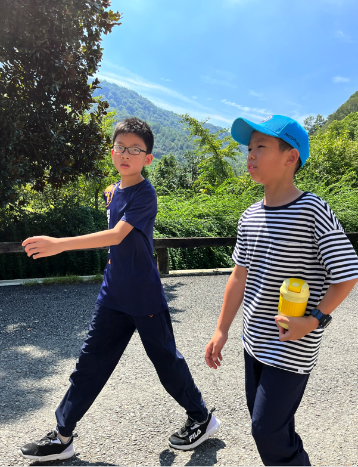
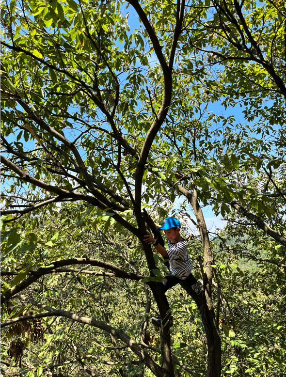
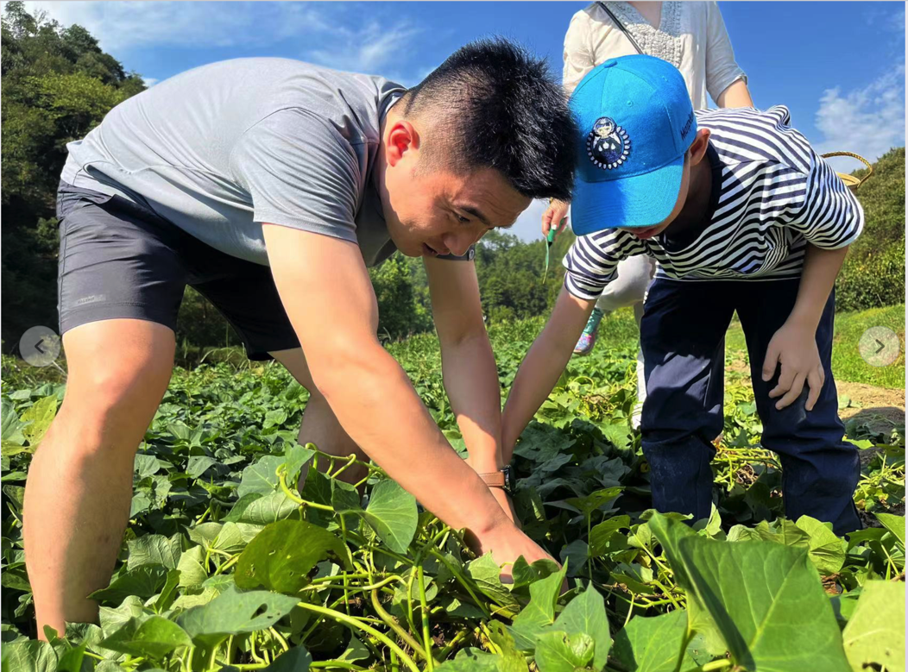
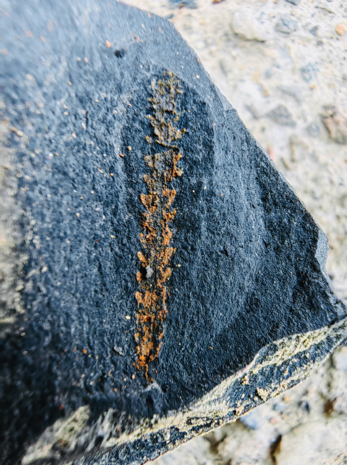

9.11 

今天去摘板栗🌰，我像一只开心栗鼠一样，在板栗山上到处找板栗。可惜它们都还没熟，开心栗鼠变成了伤心栗鼠……

This Mid-autumn moon festival I have three interesting things to share with you. 

First of all, Ruby and I went to the Chestnut hill to pick chestnuts, we discussed our roles in this activity on our way there, I was responsible for shaking the chestnuts from the tree, and Ruby was responsible for picking them up from the ground. Unfortunately, we were about three weeks early and the chestnuts were not ready to pick, because there were still green and growing on the trees. Still we had a go, and picked some green ones, but Ruby’s grandpa said there were none can be eaten, what a pity! But we still had fun and agreed we are going to come back when the nuts are ready.

Secondly, I went to Anji for a discovery tour for finding fossils. And I found many fossils of BiShi, they had very clear images of when there were alive. And i also discovered a precious fossil of an ancient sponge, it’s very old because it’s from Precambrian which is about 570 million years ago, I think I’ve spotted a big treasure which made my day. 

Lastly, my mom took me to a concert tonight, which I think the music was beautiful, and the band was from the last concert we went to, and my mom thinks the piano girl is really pretty especially when she smiles.